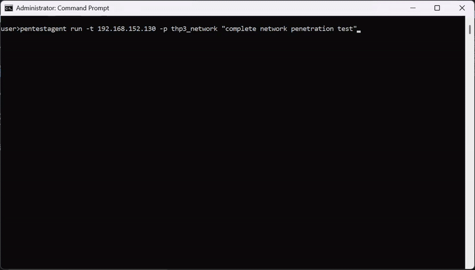

<div align="center">


# PentestAgent
### AI Penetration Testing

[](https://www.python.org/) [](LICENSE.txt) [](https://github.com/GH05TCREW/pentestagent/releases) [](https://github.com/GH05TCREW/pentestagent) [](https://github.com/GH05TCREW/pentestagent)

</div>

https://github.com/user-attachments/assets/a67db2b5-672a-43df-b709-149c8eaee975

## Requirements

- Python 3.10+
- API key for OpenAI, Anthropic, or other LiteLLM-supported provider

## Install

```bash
# Clone
git clone https://github.com/GH05TCREW/pentestagent.git
cd pentestagent

# Setup (creates venv, installs deps)
.\scripts\setup.ps1   # Windows
./scripts/setup.sh    # Linux/macOS

# Or manual
python -m venv venv
.\venv\Scripts\Activate.ps1  # Windows
source venv/bin/activate     # Linux/macOS
pip install -e ".[all]"
playwright install chromium  # Required for browser tool
```

## Configure

Create `.env` in the project root:

```
ANTHROPIC_API_KEY=sk-ant-...
PENTESTAGENT_MODEL=claude-sonnet-4-20250514
```

Or for OpenAI:

```
OPENAI_API_KEY=sk-...
PENTESTAGENT_MODEL=gpt-5
```

Any [LiteLLM-supported model](https://docs.litellm.ai/docs/providers) works.

### Using a relay / custom API base

Point PentestAgent at any OpenAI-compatible endpoint via `OPENAI_API_BASE`:

```bash
OPENAI_API_KEY=your-relay-token
OPENAI_API_BASE=https://relay.example/v1
PENTESTAGENT_MODEL=openai/<model-name-on-your-relay>
```

For Anthropic-compatible endpoints use `ANTHROPIC_API_BASE` instead.
See `.env.example` for full provider notes and embedding options.

## Run

```bash
pentestagent                      # Launch TUI
pentestagent -t 192.168.1.1       # Launch with target
pentestagent tui --docker         # Run tools in Docker container
```

## Docker

Run tools inside a Docker container for isolation and pre-installed pentesting tools.

### Option 1: Pull pre-built image (fastest)

```bash
# Base image with nmap, netcat, curl
docker run -it --rm \
  -e ANTHROPIC_API_KEY=your-key \
  -e PENTESTAGENT_MODEL=claude-sonnet-4-20250514 \
  ghcr.io/gh05tcrew/pentestagent:latest

# Kali image with metasploit, sqlmap, hydra, etc.
docker run -it --rm \
  -e ANTHROPIC_API_KEY=your-key \
  ghcr.io/gh05tcrew/pentestagent:kali
```

### Option 2: Build locally

```bash
# Build
docker compose build

# Run
docker compose run --rm pentestagent

# Or with Kali
docker compose --profile kali build
docker compose --profile kali run --rm pentestagent-kali
```

The container runs PentestAgent with access to Linux pentesting tools. The agent can use `nmap`, `msfconsole`, `sqlmap`, etc. directly via the terminal tool.

Requires Docker to be installed and running.

## Modes

PentestAgent has three modes, accessible via commands in the TUI:

| Mode | Command | Description |
|------|---------|-------------|
| Assist | `/assist <task>` | One single-shot instruction, with tool execution |
| Agent | `/agent <task>` | Autonomous execution of a single task |
| Crew | `/crew <task>` | Multi-agent mode. Orchestrator spawns specialized workers |
| Interact | `/interact <task>` | Interactive mode. Chat with the agent, it will help you and guide during the pentesting procedure |

### TUI Commands

```
/assist <task>    One single-shot instruction.
/agent <task>     Run autonomous agent on task
/crew <task>      Run multi-agent crew on task
/interact <task>  Chat with the agent in guided mode
/target <host>    Set target
/tools            List available tools
/notes            Show saved notes
/report           Generate report from session
/memory           Show token/memory usage
/prompt           Show system prompt
/conversations    Browse and restore saved conversations
/mcp <list/add>   Visualizes or adds a new MCP server.
/spawn [target] [--scope CIDR] [--model M] [--no-rag] [--no-mcp]
                  Manually spawn a child MCP agent from the TUI.
/despawn <server_name>
                  Terminate and remove a previously spawned child agent.
/clear            Clear chat and history
/quit             Exit (also /exit, /q)
/help             Show help (also /h, /?)
```

Press `Esc` to stop a running agent. `Ctrl+Q` to quit.

## Playbooks

PentestAgent includes prebuilt **attack playbooks** for black-box security testing. Playbooks define a structured approach to specific security assessments.

**Run a playbook:**

```bash
pentestagent run -t example.com --playbook thp3_web
```



## Tools

PentestAgent includes built-in tools and supports MCP (Model Context Protocol) for extensibility.

**Built-in tools:** `terminal`, `browser`, `notes`, `web_search` (requires `TAVILY_API_KEY`), `spawn_mcp_agent`

### Agent Self-Spawning (`spawn_mcp_agent`)

`spawn_mcp_agent` is a built-in tool that allows a running agent to spawn a child copy of itself as a subordinate MCP server connected over stdio. The child process is fully isolated — its own runtime, LLM client, conversation history, and notes store — and its complete tool set is injected back into the parent agent's available tools after spawning.

This enables hierarchical, multi-agent workflows without any external orchestration: the agent self-organises by delegating scoped subtasks to children it spawns on demand.

| Argument | Type | Default | Description |
|----------|------|---------|-------------|
| `target` | string | — | Pentest target to pass to the child |
| `scope` | string[] | — | In-scope targets/CIDRs for the child |
| `model` | string | env var | Model identifier, overrides `PENTESTAGENT_MODEL` on the child |
| `no_rag` | boolean | `false` | Skip RAG engine initialisation on the child |
| `no_mcp` | boolean | `true` | Skip external MCP server connections on the child (recommended) |

After `spawn_mcp_agent` returns, the child's tools (`run_task`, `run_task_async`, `await_tasks`, etc.) are available on the **next** tool call. The child's server name is assigned automatically (e.g. `child_agent_1`) and returned in the result.

**Example — orchestrator delegating parallel recon to two children:**

```
# Turn 1: spawn two isolated child agents
spawn_mcp_agent  target="10.0.1.0/24"  scope=["10.0.1.0/24"]
spawn_mcp_agent  target="10.0.2.0/24"  scope=["10.0.2.0/24"]

# Turn 2: children's tools are now available — delegate work asynchronously
child_agent_1__run_task_async  task="Full port scan and service enumeration"
child_agent_2__run_task_async  task="Full port scan and service enumeration"

# Turn 3: wait and collect
child_agent_1__await_tasks  task_ids=["<id1>"]  timeout_seconds=600
child_agent_2__await_tasks  task_ids=["<id2>"]  timeout_seconds=600
child_agent_1__get_task_result  task_id="<id1>"
child_agent_2__get_task_result  task_id="<id2>"
```

### Manual Child Agent Control (`/spawn` and `/despawn`)

Beyond the automatic `spawn_mcp_agent` tool, the TUI exposes two commands that let you spawn and terminate child agents **manually**, independently of a running agent loop.

#### `/spawn`

```
/spawn [target] [--scope CIDR ...] [--model MODEL] [--no-rag] [--no-mcp]
```

Spawns a new child MCP agent over stdio and attaches it to the current session. The child appears as a collapsible terminal panel in the TUI sidebar and its tools become available to the parent agent on the next tool call.

| Argument | Description |
|----------|-------------|
| `target` | Pentest target to pass to the child (positional or `--target`) |
| `--scope CIDR` | One or more in-scope CIDRs (repeatable) |
| `--model MODEL` | Override the model for the child agent |
| `--no-rag` | Skip RAG engine initialisation on the child |
| `--no-mcp` | Skip external MCP server connections on the child |

**Examples:**

```
/spawn 10.0.1.1
/spawn 10.0.1.1 --scope 10.0.1.0/24 --model claude-sonnet-4-20250514
/spawn --target 10.0.1.1 --scope 10.0.1.0/24 --no-rag
```

#### `/despawn`

```
/despawn <server_name>
```

Terminates the child agent identified by `server_name` (e.g. `child_agent_1`), removes its terminal panel from the TUI, and disconnects its tools from the parent session. Use `/mcp list` to see the names of all currently active child agents.

**Example:**

```
/despawn child_agent_1
```

### MCP RAG Tool Optimizer

When an MCP server exposes more than 128 tools, PentestAgent automatically replaces the full catalogue with a single `mcp_<server>_rag_optimizer` tool. This meta-tool uses embedding similarity (via LiteLLM, default `text-embedding-3-small`) to retrieve the most relevant tools for the task at hand and injects them into the agent's next turn — keeping the context window manageable without losing access to the full tool set.

The optimizer is transparent to the agent: it calls the RAG tool with focused natural-language queries describing what it needs, and the matching tools become available on the next turn to call directly.

**Usage guidance for the agent:**

| Argument | Type | Default | Description |
|----------|------|---------|-------------|
| `queries` | string[] | *(required)* | One focused query per capability needed. More specific = higher accuracy |
| `top_k` | integer | `20` | Tools to retrieve per query (max 128). Results are merged and deduplicated |

Embeddings are computed once at startup and cached, so repeated queries are fast. The optimizer is built per-server, so each MCP server with a large catalogue gets its own independent index.

> **Tip:** Pass one query per distinct capability rather than combining everything into one query. `["list open ports on a host", "get process memory usage"]` retrieves better results than `["list ports and memory and CPU"]`.

### MCP Integration

PentestAgent supports MCP (Model Context Protocol) in two directions: **consuming** external MCP servers as tool sources, and **exposing itself** as an MCP server so external clients (Claude Desktop, Cursor, etc.) can drive PentestAgent programmatically.

---

#### Consuming External MCP Servers (Client Mode)

Configure `mcp_servers.json` to connect PentestAgent to any external MCP servers. Example config:

```json
{
  "mcpServers": {
    "nmap": {
      "command": "npx",
      "args": ["-y", "gc-nmap-mcp"],
      "env": {
        "NMAP_PATH": "/usr/bin/nmap"
      }
    }
  }
}
```

---

#### Exposing PentestAgent as an MCP Server (Server Mode)

PentestAgent can run as an MCP server, allowing any MCP-compatible client to submit tasks, inspect results, and control the agent remotely. Two transports are supported:

**STDIO** — for local clients (e.g. Claude Desktop, Cursor):

```bash
pentestagent mcp_server --type stdio
pentestagent mcp_server --type stdio --target 192.168.1.1 --scope 192.168.1.0/24
pentestagent mcp_server --type stdio --model claude-sonnet-4-20250514 --docker
```

**SSE (HTTP)** — for remote or networked clients:

```bash
pentestagent mcp_server --type sse
pentestagent mcp_server --type sse --host 0.0.0.0 --port 8080
pentestagent mcp_server --type sse --target 10.0.0.1 --scope 10.0.0.0/24 --docker
```

The SSE transport exposes a single `/mcp` endpoint supporting `POST` (requests), `GET` (persistent SSE stream for server-initiated push), and `DELETE` (session teardown). Sessions are tracked via the `Mcp-Session-Id` header.

**All `mcp_server` flags:**

| Flag | Default | Description |
|------|---------|-------------|
| `--type` | *(required)* | Transport: `stdio` or `sse` |
| `--host` | `0.0.0.0` | SSE bind host |
| `--port` | `8080` | SSE bind port |
| `--target` | none | Primary pentest target (IP / hostname) |
| `--scope` | `[]` | In-scope targets/CIDRs (space-separated) |
| `--model` | env var | Model identifier, overrides `PENTESTAGENT_MODEL` |
| `--docker` | false | Use DockerRuntime instead of LocalRuntime |
| `--no-rag` | false | Skip RAG engine initialisation |
| `--no-mcp` | false | Skip external MCP server connections |

##### Example: Claude Desktop config (`claude_desktop_config.json`)

```json
{
  "mcpServers": {
    "pentestagent": {
      "command": "pentestagent",
      "args": ["mcp_server", "--type", "stdio"]
    }
  }
}
```

---

#### MCP Server Tools Reference

When acting as an MCP server, PentestAgent exposes the following tools:

**Server Status & Config**

| Tool | Description |
|------|-------------|
| `get_server_status` | Live server status: readiness, task counts by state, primary target/scope, memory store size |
| `get_config` | Primary agent configuration: target, scope, max iterations, tool list |
| `update_config` | Update target, scope, or max iterations for all subsequent tasks |

**Task Execution**

| Tool | Description |
|------|-------------|
| `run_task` | Submit a task and **block** until it completes. Returns full result, tools used, and notes snapshot |
| `run_task_async` | Submit a task and **return immediately** with a `task_id`. Poll with `get_task_status` |

**Task Inspection**

| Tool | Description |
|------|-------------|
| `list_tasks` | List all tasks with status, target, and summary. Filterable by status |
| `get_task_status` | Poll the current status and result preview of a task |
| `get_task_result` | Full task result: final output, thinking steps, all tool calls and results, notes snapshot |
| `await_tasks` | Block until a set of async task IDs have all finished (polls every 500 ms, configurable timeout) |

**Task Control**

| Tool | Description |
|------|-------------|
| `cancel_task` | Cancel a running or pending task by ID |

**Tool Management**

| Tool | Description |
|------|-------------|
| `list_tools` | List all tools available to the agent |
| `enable_tool` | Enable a named tool on the primary agent |
| `disable_tool` | Disable a named tool on the primary agent |


**Conversation History**

| Tool | Description |
|------|-------------|
| `get_conversation_history` | Return message history for a task or the primary agent. Supports a `limit` parameter |
| `reset_conversation` | Clear conversation history for a task or the primary agent |

**Memory**

| Tool | Description |
|------|-------------|
| `store_memory` | Persist a key-value pair to the in-process memory store |
| `retrieve_memory` | Retrieve by exact key, search by substring, or list all keys |
| `clear_memory` | Delete a specific key or wipe all memory with `scope='all'` |

**Observability**

| Tool | Description |
|------|-------------|
| `get_logs` | Return recent execution logs, optionally filtered by level (`info` / `warning` / `error`) |
| `get_metrics` | Runtime metrics: task counts, success rate, total tool calls, memory and log sizes |

---

#### Async Task Workflow Example

For long-running recon tasks, use the async pattern:

```
# 1. Submit tasks without blocking
run_task_async  task="Enumerate subdomains of example.com"  target="example.com"
run_task_async  task="Run nmap SYN scan on example.com"     target="example.com"

# 2. Block until both finish (up to 5 minutes)
await_tasks  task_ids=["<id1>", "<id2>"]  timeout_seconds=300

# 3. Retrieve full results
get_task_result  task_id="<id1>"
get_task_result  task_id="<id2>"
```

---

### CLI Tool Management

```bash
pentestagent tools list         # List all tools
pentestagent tools info <name>  # Show tool details
pentestagent mcp list           # List MCP servers
pentestagent mcp add <name> <command> [args...]  # Add MCP server
pentestagent mcp test <name>    # Test MCP connection
```

## Conversation History Controls

Each user message in the TUI exposes two inline action buttons: **rewind** and **fork**.

### Rewind

Click **rewind** on any user message to truncate the conversation back to just before that message — both in the UI and in the agent's in-memory history. Use it to retry a query from scratch without saving the discarded path.

### Fork

Click **>> fork** on any user message to branch the conversation from that point:

1. The current full conversation is **saved** to the conversation store and a short snapshot ID is shown.
2. The conversation is then **truncated** to just before the selected message (same as rewind).

This lets you try an alternative approach from any point while keeping the original thread retrievable via `/conversations`.

---

## Conversation History

PentestAgent automatically persists every conversation so you can review, compare, and restore past sessions.

**Auto-save** triggers after each `/assist`, `/agent`, `/crew`, and `/interact` task, and before `/clear`. Up to 20 conversations are kept; older ones are pruned automatically.

**Storage location:** `workspaces/<active>/memory/conversations/` when a workspace is active, or `conversations/` at the project root otherwise. Each conversation is a JSON file.

**Browse & restore with `/conversations`:**

The `/conversations` command opens a split-pane modal inside the TUI:
- **Left panel** — list of saved conversations with title and date.
- **Right panel** — metadata preview plus the first 5 messages (user messages in blue, agent responses in green, tool calls in yellow, tool results in grey). A count shows how many additional messages exist.


Select a conversation and press **Restore** to reload it into the current session, or **Close** to dismiss the modal.

## Knowledge

- **RAG:** Place methodologies, CVEs, or wordlists in `pentestagent/knowledge/sources/` for automatic context injection.
- **Notes:** Agents save findings to `loot/notes.json` with categories (`credential`, `vulnerability`, `finding`, `artifact`). Notes persist across sessions and are injected into agent context.
- **Shadow Graph:** In Crew mode, the orchestrator builds a knowledge graph from notes to derive strategic insights (e.g., "We have credentials for host X").

## Project Structure

```
pentestagent/
  agents/         # Agent implementations
  config/         # Settings and constants
  interface/      # TUI and CLI
  knowledge/      # RAG system and shadow graph
  llm/            # LiteLLM wrapper
  mcp/            # MCP client and server configs
  playbooks/      # Attack playbooks
  runtime/        # Execution environment
  tools/          # Built-in tools
```

## Development

```bash
pip install -e ".[dev]"
pytest                       # Run tests
pytest --cov=pentestagent    # With coverage
black pentestagent           # Format
ruff check pentestagent      # Lint
```

## Legal

Only use against systems you have explicit authorization to test. Unauthorized access is illegal.

## License

MIT
