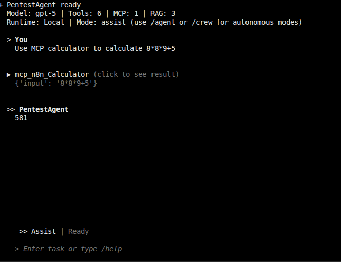
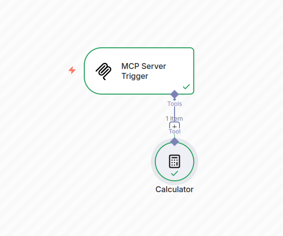
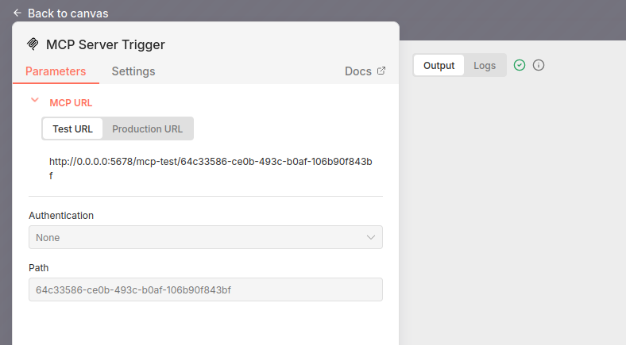
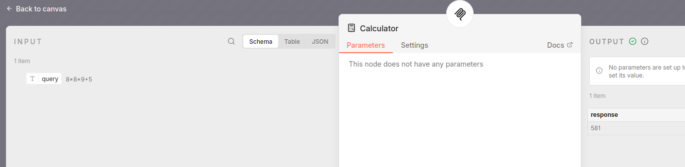

# N8N MCP integration

## Steps

1. Adjust the mcp_servers.json to point to your MCP server in n8n.

``` json
{
  "mcpServers": {
    "n8n": {
      "type": "sse",
      "url": "http://192.168.0.19:5678/mcp/64c33586-ce0b-493c-b0af-106b90f843bf"
    }
  }
}
```

For authentication:

``` json
{
  "mcpServers": {
    "n8n": {
      "type": "sse",
      "url": "http://192.168.0.19:5678/mcp/64c33586-ce0b-493c-b0af-106b90f843bf",
      "bearer": "aeiou"
    }
  }
}
```

2. Execute the docker commands.

```bash
docker-compose run --rm pentestagent
```

The n8n MCP server should be available:







