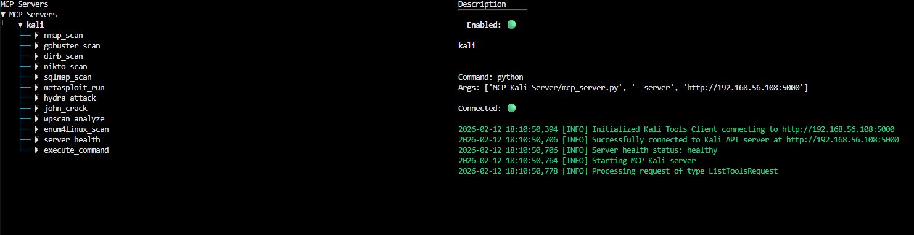
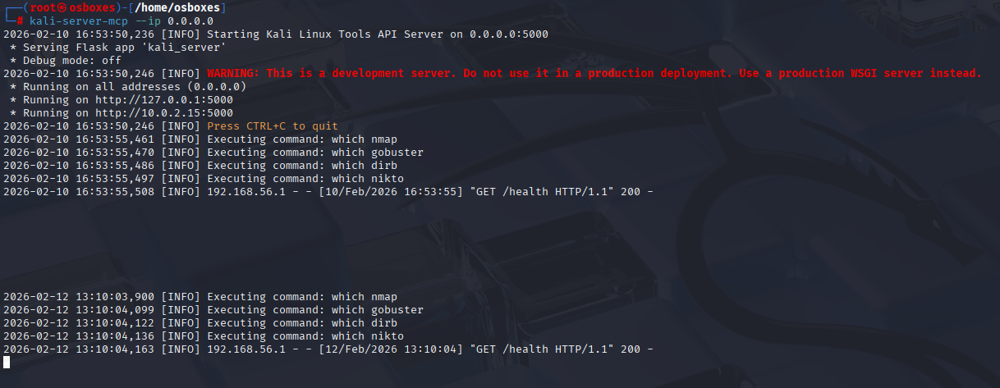

# KALI MCP integration

## Steps

1. Configure .env file with API tokens and models for AI.

```
OPENAI_API_KEY=sk-...
PENTESTAGENT_MODEL=gpt-5
```

2. Configure the IP address or hostname in the mcp_servers.json file:

``` json
{
  "mcpServers": {
    "kali": {
      "command": "python",
      "args": ["MCP-Kali-Server/mcp_server.py", "--server", "http://<hostname>:5000"]
    }
  }
}
```

3. Launch docker-compose

```bash
# Build
docker-compose build

# Run
docker-compose run --rm pentestagent

```

At this point, you will be able to check the MCP servers with the /mcp list command



On server side, there should be a connection incoming:

